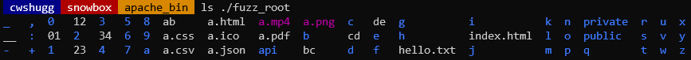
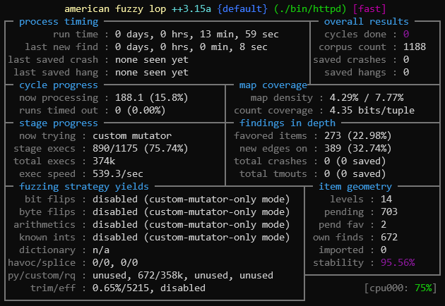
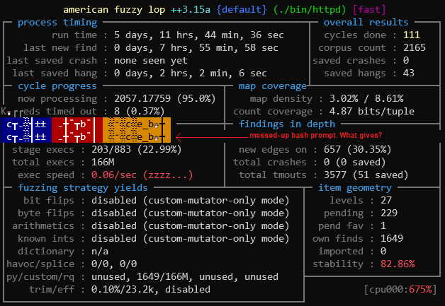
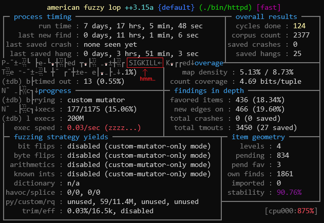

# Fuzzing Apache's `httpd`

The first of the well-known (and likely very robust) HTTP servers I chose to fuzz was Apache's open source web server.

# Step 0: The Environment

I've found it helpful in the past to define a few environment variables (in my `.bashrc`) to assist with pointing at specific directories and execuables. For fuzzing, I've set up a few:

```bash
# fuzzing (afl++)
AFLCC=/path/to/AFLplusplus/afl-clang-fast
AFLCXX=/path/to/AFLplusplus/afl-clang-fast
AFLFUZZ=/path/to/AFLplusplus/afl-fuzz

# fuzzing (gurthang)
GURTHANG_DIR=/path/to/gurthang
GURTHANG_LIB=${GURTHANG_DIR}/gurthang-preload.so
GURTHANG_MUT=${GURTHANG_DIR}/gurthang-mutator.so
```

These point to the AFL++ compiler and fuzzer binaries, as well as the two gurthang libraries I've created (the mutator and the preload library).

# Step 1: Downloading and Building

The first necessary step I needed to take was getting a copy of Apache's source code and building it with the AFL++ compiler. So, I visited to https://httpd.apache.org/download.cgi to download and unpack the latest source code version.

```bash
# download the tar archive
wget https://dlcdn.apache.org//httpd/httpd-2.4.51.tar.bz2
# unpack the code
tar -xf ./httpd-2.4.51.tar.bz2
# give the directory an easier name
mv ./httpd-2.4.51.tar.bz2 ./apache_src
```

I then visited Apache's GitHub repository to look at their build and installation guide (https://github.com/apache/httpd/blob/trunk/INSTALL). You're expected to provide a directory in which Apache will be installed. Since I'm only doing this for fuzzing, I went ahead and set up a new directory just for that:

```bash
mkdir ./apache_bin

# in my .bashrc...
APACHE_DIR=/path/to/apache_bin
```

In order to build Apache, we need the **Apache Portable Runtime** library installed before configuring and making. There are a few ways to do this, but the build documentation seems to suggest it's more advantageous for those wishing to debug `httpd` code to drop it directly into the Apache `srclib/` directory:

```bash
# prior to the below command, you may need to install subversion. On Ubuntu, I ran:
sudo apt install subversion

# within ./apache_src:
svn co http://svn.apache.org/repos/asf/apr/apr/trunk srclib/apr
```

Now to build the APR library:

```bash
# install 'libtool', something we need to build APR via svn (subversion)
sudo apt install libtool-bin

# run the build configure shell script (within ./apache_src)
./buildconf
```

From here, we configure, specifying our "prefix" directory and the `--with-included-apr`, to use the source code we just dropped into `./apache_src/srclib/apr/`. We also want to specify the AFL++ compiler at this stage, through the `CC` and `CXX` environment variables.

We're also enabling the `worker` threading model for Apache, since my fuzzing library is interested in working with multiple threads (across multiple connections to the target server). Information can be found here: https://httpd.apache.org/docs/2.4/mod/worker.html.

```bash
# configure (thanks GitHub security lab for the helpful guide!)
# (https://securitylab.github.com/research/fuzzing-apache-1/)
CC=$AFLCC \
CXX=$AFLCXX \
CFLAGS="-g" \
EXTRA_CFLAGS="-g" \
CPPFLAGS="-g" \
./configure --prefix=${APACHE_DIR} --with-included-apr \
            --enable-static-support \
            --enable-mods-static=few \
            --disable-pie \
            --enable-debugger-mode \
            --with-mpm=worker

# we should receive output that looks something like this:
    Server Version: 2.4.51
    Install prefix: /home/cwshugg/workspace/fuzzing/winter2021/apache_bin
    C compiler:     /home/cwshugg/workspace/fuzzing/AFLplusplus/afl-clang-fast
    CFLAGS:         -g -pthread -g -O0 -Wall -Wstrict-prototypes -Wmissing-prototypes -Wmissing-declarations -Wdeclaration-after-statement -Werror=declaration-after-statement -Wpointer-arith -Wformat -Wformat-security -Werror=format-security
    CPPFLAGS:       -DLINUX -D_REENTRANT -D_GNU_SOURCE -g  -DAP_DEBUG
    LDFLAGS:
    LIBS:
    C preprocessor: /home/cwshugg/workspace/fuzzing/AFLplusplus/afl-clang-fast -E
```

The last few steps are invoking `make` commands. Thanks to us configuring with `afl-clang-fast`, it will be invoked during the build process without us needing to add `CC=$AFLCC` in the `make` command. We'll also enable one or two environment variables for the AFL++ compiler:

* `AFL_LLVM_LAF_ALL` enables the splitting up of large comparison operations into several smaller ones, making it easier for AFL++ to discover them over time.
* More environment variables can be found here: https://aflplus.plus/docs/env_variables/

(Also - I had a LLVM/clang version 13.0.1 installed when doing this.)

```bash
# build the server. You can of course use -j to specify multiple cores.
AFL_LLVM_LAF_ALL=1 make

# install in our selected directory (./apache_bin)
make install
```

# Step 2: Fuzzing Setup

The next step is to set up files needed for fuzzing. Chiefly, we need our AFL++ set of input files, root directory for `httpd` to serve from, and a modified `httpd.conf` Apache config file.

## Root Directory

To create a root directory, I wrote a small script to create several folders and files in a new directory:



Take all the contents of this new directory and recursively copy them into the `htdocs/` directory. This is the default location for Apache to serve files.

## Apache Config File

Now to modify the Apache configuration file. Most of the config file is made up of **directives** (key-value pairs). Here are the ones I modified/added:

### Misc. Configurations

- [`ServerName`](https://httpd.apache.org/docs/current/mod/core.html#servername) - I set this to `127.0.0.1` just to make sure we can make a local connection o the server.
- [`Listen`](https://httpd.apache.org/docs/current/mod/mpm_common.html#listen) - I changed this from `80` to `8080` so we don't have to deal with `sudo` in order to launch the server on a reserved, < 1024 port number.
- [`LoadModule`](https://httpd.apache.org/docs/current/mod/mod_so.html#loadmodule) - because of the way I compiled apache (where modules are statically linked), just all of the un-commented `LoadModule MODULE_NAME MODULE_LIBRARY_PATH` lines needed to be commented out.

### Concurrency Configurations

To test my multithreaded web server fuzzing library, I'd like this single Apache process to have multiple threads. With the `worker` MPM concurrency model, we can have just that. With these fields we can adjust how many processes and threads we want:

- [`StartServers`](https://httpd.apache.org/docs/2.4/mod/mpm_common.html#startservers) - this sets the number of child server processes created on startup. I'll set this to `1`.
- [`ThreadsPerChild`](https://httpd.apache.org/docs/2.4/mod/mpm_common.html#threadsperchild) - this sets the number of threads spawned by each child process. I'll keep this relatively simple and set it to `4`.

## AFL++ Inputs

The fuzzing library I created (called "gurthang") reads a specific file format, then extracts HTTP message data out of it before sending it to the target server via a local connection.

The first step to get a series of input files ready is to get a directory of plain HTTP messages in ASCII text files. Fortunately, I have several of these already from the fuzzing infrastructure I've helped build into VT's CS 3214 "Computer Systems" course. An example:

```bash
$ cat ./video_v1_get_100.txt

GET /a.mp4 HTTP/1.1
Host: 127.0.0.1:8080
Accept-Encoding: identity
Range: bytes=0-100
```

To add onto these, I added `GET` requests for each of the file types I created in `fuzz_root/`, as well as a few other requests using methods other than just `GET` and `POST`. I got these from the same GitHub security lab post mentioned above, in this repository: https://github.com/antonio-morales/Apache-HTTP-Fuzzing.

Now that we've got *lots* of HTTP files, we need to convert them to our special file format. I have scripts just for that purpose. Within the `gurthang/` repository, there is `scripts/make-afl-inputs.sh` By doing the following:

```bash
/path/to/gurthang/scripts/make-afl-inputs.sh /path/to/inputs /path/to/new/inputs_comux
```

The script converts each file to multiple different "comux" files (Connection Multiplexing), and randomly mixes some together. These files will allow my library, to spawn multiple connections to Apache in a single fuzzing run, sending HTTP data in varying orders across these connections. The hope here is to find some interesting concurrency bugs.

# Step 3: Fuzzing

Finally, it's time to fuzz. We'll once again draw from the knowledge and discoveries of Antonio Morales, the GitHub Security Lab engineer who previously [fuzzed Apache with AFL++](https://securitylab.github.com/research/fuzzing-apache-1/). Using some of his environment variables (such as increasing the `AFL_MAP_SIZE`), our big bad fuzzing command will look like this:

```bash
# A few notes on the gurthang environment variables:
#   - GURTHANG_LIB_EXIT_IMMEDIATE: this tells the LD_PRELOAD library to call
#     '_exit()' rather than 'exit()', to avoid having a non-Apache thread
#     executing the Apache exit handler code.

# A few notes on AFL environment variables used:
#   - AFL_MAP_SIZE: this sets the size of the shared memory region between the
#     parent process (AFL++) and each child process it spawns. I chose 112552
#     because the instrumented binary complained and suggested it.
#   - AFL_PRELOAD: we're preloading the target (Apache) with my LD_PRELOAD
#     library for gurthang
#   - AFL_CUSTOM_MUTATOR_LIBRARY: we're telling AFL++ to use my gurthang
#     mutator while fuzzing.
#   - AFL_CUSTOM_MUTATOR_ONLY: we're telling AFL++ to ONLY use the gurthang
#     mutator for mutations. Don't use any other mutations.
#   - AFL_HANG_TMOUT: we're setting this to the number of milliseconds before a
#     hang is flagged as an actual hang.
#   - AFL_FORKSRV_INIT_TMOUT: we're setting this to have AFL++ wait a decent
#     amount of time for the forkserver to initialize.
# The timeout-related environment variables are added to reduce false-positive hangs.

# A few notes on the AFL++ arguments:
#   -t 4000: this tells AFL++ to override the auto-computed timeout with 4
#   seconds.
#   -m none: no memory limit! Woohoo!

# navigate to the installation directory
cd ./apache_bin

# run the fuzzer
GURTHANG_LIB_EXIT_IMMEDIATE=1 \
AFL_MAP_SIZE=112552 \
AFL_PRELOAD=${GURTHANG_LIB} \
AFL_CUSTOM_MUTATOR_LIBRARY=${GURTHANG_MUT} \
AFL_CUSTOM_MUTATOR_ONLY=1 \
AFL_HANG_TMOUT=5000 \
AFL_FORKSRV_INIT_TMOUT=10000 \
${AFLFUZZ} -t 4000 -m none -i /path/to/inputs_comux -o ./fuzz_out -- ./bin/httpd -X
```

## First-Attempt Failures

After trying an initial fuzzing run, I noticed a few important details:

- **Fuzzing was slow**. I was pulling about 65 executions per second, which is quite slow compared to other programs I've fuzzed before.
- **Stability was bad**. It was at about 45% for the first 15 minutes. I suspected this had to do with the random generation involved in some of Apache's initialization code.

### Deferred Initialization

To fix both of these, I turned to AFL++'s **deferred initialization** trick, described [here](https://github.com/AFLplusplus/AFLplusplus/blob/stable/instrumentation/README.persistent_mode.md). Typically, AFL++'s forkserver halts the target just before `int main()`, then takes a "checkpoint". All executions during fuzzing start from this "checkpoint". This helps a lot with performance, since each execution doesn't have to go through the same kernel process start-up code.

It's not perfect for some programs though, and Apache is one such case. Apache's main method (in `server/main.c`) parses configuration files, generates thousands of random bytes for a RNG seed, and performs other expensive initialization operations. With deferred initialization, we can tell AFL++'s forkserver to take the checkpoint *after* all of this has ocurred, simply by dropping this into the source code:

```C
#ifdef __AFL_HAVE_MANUAL_CONTROL
    __AFL_INIT();
#endif
```

After doing some digging, I found that Apache spawns all of its worker threads in its call to `ap_run_mpm()` in a do-while loop in `main()`. After those are spawned, it's off to the races and actual web server stuff begins. So, the one and only modification I made to the Apache source code is as follows:

```C
// ${apache_src}/server/main.c (Apache httpd 2.4.51)
// =================================================
// Rough line numbers are shown below. It might be a little bit different for you
// if you're fuzzing a different version of Apache. This is within main().

818         ap_main_state = AP_SQ_MS_RUN_MPM;
819         // ---------------------------- FUZZING ---------------------------- //
820         // Deferred initialization. Initialize the forkserver checkpoint
821         // *just* before we spawn all the workers.
822         #ifdef __AFL_HAVE_MANUAL_CONTROL
823             __AFL_INIT();
824         #endif
825         // ----------------------------------------------------------------- //
826         rc = ap_run_mpm(pconf, plog, ap_server_conf);
```

With that, a quick recompile and `make install`, we're fuzzing at much better speeds (about 550 executions per second) *and* stability (around 96%):



## 5 Days Later

About five and a half days later, the fuzzer had discovered a total of 2165 paths of execution, and completed 166 million executions. No crashes were found, but several hangs were reported. The stability had decreased down to 82-84%.



Unfortunately, the fuzzer stopped without explanation. Better yet, my bash prompt had been gunked up by some special characters that might have been dumped to `stdout` during the fuzzing process. I'll need to explore this later.

Since I was going to be away from the computer for a few days, I went ahead and continued the same fuzzing session. I ran the exact same command as shown above, with one change: changing `-i /path/to/inputs_comux` to `-i -`. This tells AFL++ to resume the existing fuzzing session stored in the given output directory (`-o`).

## 2 (more) days later

After a few more days, the fuzzer once again stopped without explanation, with the same issue of my bash prompt having its output garbled. To get to the bottom of it, I reran AFL++ in GDB, telling it to continue the same fuzzing session. It ran for a short time (about 17 hours) before being stopped. The output was once again garbled, but GDB mentioned the receival of a `SIGKILL`.



I eventually found time to explore this and attempted fuzzing again, resulting in the same `SIGKILL`. Thanks to `dmesg`, I learned that AFL++ had run out of memory:

```
[110250.432322] oom-kill:constraint=CONSTRAINT_NONE,nodemask=(null),cpuset=/,mems_allowed=0,global_oom,task_memcg=/,task=afl-fuzz,pid=31693,uid=1000
[110250.432332] Out of memory: Killed process 31693 (afl-fuzz) total-vm:12413320kB, anon-rss:7161480kB, file-rss:0kB, shmem-rss:112kB, UID:1000 pgtables:24320kB oom_score_adj:0
[110250.635984] oom_reaper: reaped process 31693 (afl-fuzz), now anon-rss:0kB, file-rss:0kB, shmem-rss:112kB
```

The `LD_PRELOAD` library is constantly started and re-started, so this wouldn't be the source of the memory leak. It's the AFL++ process itself that was killed. So in other words, my custom mutator has a memory leak. After an hour or so of debugging, I discovered (thanks to Valgrind) a leak in my mutator's trimming processes. With that fixed, I reran the fuzzer, with a little something extra.

## Fuzzing with Dictionaries

After pausing for a time before debugging the source of the `SIGKILL` memory leak, I spent time implementing dictionaries into gurthang's custom mutator. Now, by passing file paths via the `GURTHANG_MUT_DICT` environment variable, the mutator will search for words in the given dictionaries within a test case, and swap the word out for a *different* random word in the same dictionary. Take this dictionary of words for example:

```
GET
POST
PUT
HEAD
DELETE
CONNECT
OPTIONS
TRACE
PATCH
```

These are all HTTP request methods. The mutator, having been provided this dictionary, might encounter a test case containing a `GET` request. Seeing the word `GET`, it may choose to swap `GET` for another request method, such as `PUT`. I hope this moves gurthang towards a more grammar-friendly way of fuzzing. Dictionaries (or "dictionary swapping," as I've named the mutation strategy) aren't perfect, but they're much faster to implement than a full HTTP grammar system (something I don't have time for).

