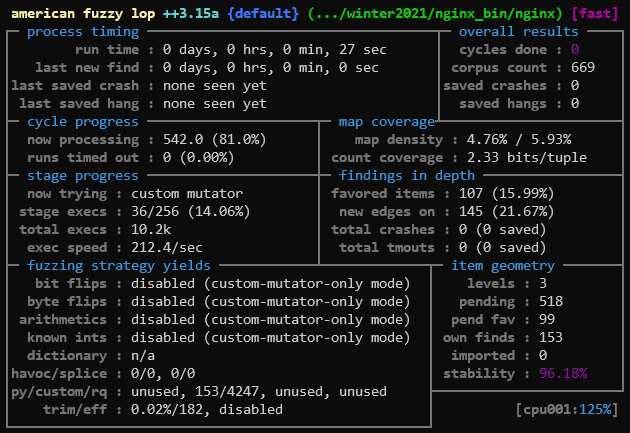
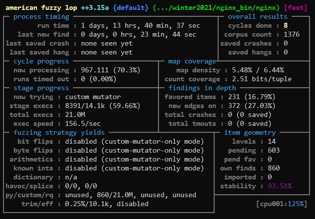

# Fuzzing NGINX

Nginx was the second web server I wanted to fuzz, considering how much it's
used.

# Step 0: The Environment

Just like when I fuzzed Apache, I'll set up the same environment variables for
fuzzing:

```bash
# fuzzing (afl++)
AFLCC=/path/to/AFLplusplus/afl-clang-fast
AFLCXX=/path/to/AFLplusplus/afl-clang-fast
AFLFUZZ=/path/to/AFLplusplus/afl-fuzz

# fuzzing (gurthang)
GURTHANG_DIR=/path/to/gurthang
GURTHANG_LIB=${GURTHANG_DIR}/gurthang-preload.so
GURTHANG_MUT=${GURTHANG_DIR}/gurthang-mutator.so
```

# Step 1: Building from Source

The first step here was to get a copy of the source code.
[This page](https://docs.nginx.com/nginx/admin-guide/installing-nginx/installing-nginx-open-source/)
describes two versions: **mainline** and **stable**. **Mainline** is noted to
include all the latest features and bug fixes, whereas **stable** contains only
the most stable features and is recommended for production servers. We'll
choose **mainline** in hopes of finding some buggy new features.

## Getting Dependencies & Source

Moving onto the **Compiling and Installing from Source** section, I first
installed the needed dependencies: [PCRE](http://pcre.org/),
[zlib](http://www.zlib.net/), and [OpenSSL](https://www.openssl.org/). It
seems as though the actual *source code* for zlib and PCRE are needed, based
on what the documentation states and how they're used in NGINX's `configure`
script prior to building. So we'll place the dependencies into a new directory:

```bash
$ mkdir ./nginx_deps        # make new directory
$ cd $./nginx_deps          # navigate to directory

# PCRE - download and unpack
$ wget https://github.com/PhilipHazel/pcre2/releases/download/pcre2-10.39/pcre2-10.39.tar.gz
$ tar -xf pcre2-10.39.tar.gz

# zlib - download and unpack
$ wget http://www.zlib.net/zlib-1.2.11.tar.gz
$ tar -xf zlib-1.2.11.tar.gz

# openssl - install
$ sudo apt install openssl

cd ..                       # exit directory
```

Following this, I downloaded the latest mainline source code from
[here](http://nginx.org/en/download.html) and dropped it into a directory of
my choosing:

```bash
$ wget http://nginx.org/download/nginx-1.21.6.tar.gz    # download
$ tar -xf nginx-1.21.6.tar.gz                           # unpack
$ mv ./nginx-1.21.6 ./nginx_src                         # rename directory
```

With that, we'll set up a few variables to make life easier for the rest of
the process (I placed these in my `.bashrc`):

```bash
# nginx paths
NGINX_SRC=/home/cwshugg/workspace/fuzzing/winter2021/nginx_src
NGINX_DEPS=/home/cwshugg/workspace/fuzzing/winter2021/nginx_deps
NGINX_BIN=/home/cwshugg/workspace/fuzzing/winter2021/nginx_bin
```

## Configuring

Before anything, we'll make a directory to hold the installation, then change
into the source directory:

```bash
$ mkdir ./nginx_bin
$ cd ./nginx_src
```

The next step is to configure nginx. It seems nginx has a long list of
`--with-*` options for this script to enable its various modules. They're
listed on [this page](https://nginx.org/en/docs/configure.html).
We'll use the following options:

* `--prefix` - the file prefix at which nginx will "keep server files". We'll
  use the directory we just set up, pointed at by our bash variable:
  `${NGINX_BIN}`.
* `--sbin-path` - this is the path to where the compiled binary will be placed.
  We'll use a path within our bin directory: `${NGINX_BIN}/nginx`.
* `--with-pcre=` - this is used to point at the downloaded PCRE dependency.
  We'll point to what we unpacked earlier: `${NGINX_DEPS}/pcre2-10.39`.
* `--with-zlib=` - this is used to point at the downloaded zlib dependency.
  We'll point to what we unpacked earlier: `${NGINX_DEPS}/zlib-1.2.11`.
* `--with-debug` - this enables the nginx debug log.
* `--with-cc-opt=` - this allows us to specify compiler flags. We'll use this
  to make sure nginx is compiled with debug symbols (`-g`).

We'll also enable a few specials modules to increase our exploration space:

* `--with-threads` - this enables the use of threadpools. Since my mutator's
  comux files open multiple connections at once, enabling this is a must.
* `--with http_v2_module` - adds support for HTTP/2. Our mutator might decide
  to make an HTTP request show "HTTP/2", so this could be interesting to try.
* `--with-http_realip_module` - adds a module that "changes the client address
  to the address sent in the specified header field". Sounds like this might
  be another way to feed nginx some unexpected input.
* `--with-http_mp4_module` - this provides what is called "pseudo-streaming"
  support for MP4 files. I'm not too familiar with this, but I know our
  server's root directory will have MP4s in it, so we'll try it.
* `--with-http_auth_request_module` - this enables client authentication
  request support. While I haven't crafted any specific inputs for this, it
  will be more execution space for the fuzzer to (hopefully) discover.
* `--with-http_slice_module` - this splits requests into sub-requests, allowing
  for responses to be sent in chunks. This makes caching easier, supposedly.
  And where there's performance optimizations, there might be security bugs.
* `--with-http_stub_status_module` - this enables client access to basic server
  status information. More space for the fuzzer to search.

Now, we build the full command, change into the source directory, and configure.
Make sure to specify the AFL++ compiler.

```bash
$ cd ./nginx_src
$ CC=${AFLCC} ./configure \
        --prefix=${NGINX_BIN} \
        --sbin-path=${NGINX_BIN}/nginx \
        --with-pcre=${NGINX_DEPS}/pcre2-10.39 \
        --with-zlib=${NGINX_DEPS}/zlib-1.2.11 \
        --with-debug \
        --with-cc-opt='-g' \
        --with-threads \
        --with-http_v2_module \
        --with-http_realip_module \
        --with-http_mp4_module \
        --with-http_auth_request_module \
        --with-http_slice_module \
        --with-http_stub_status_module
```

Run the command. Once it's done, we're ready to build.

## Building

Building is as simple as running `make`. We'll set the following environment
variables during the build process:

* `AFL_LLVM_LAF_ALL` enables the splitting up of large comparison operations
  into several smaller ones, making it easier for AFL++ to discover them over
  time.
* More environment variables can be found here:
  https://aflplus.plus/docs/env_variables/

```bash
$ AFL_LLVM_LAF_ALL=1 make   # build source code
$ make install              # install nginx to ${NGINX_BIN}
```

You'll know the AFL++ compiler LAF comparison split is working if you see
something like this in the build output:

```
Split-compare-pass by laf.intel@gmail.com, extended by heiko@hexco.de (splitting icmp to 8 bit)
Split-floatingpoint-compare-pass: 0 FP comparisons splitted
```

Once installed, we'll modify the default nginx configuration file (which is now
located in `${NGINX_BIN}/conf/nginx.conf`):

```bash
# ... within the config file ...
thread_pool fuzzing threads=8;  # add this to dictate thread spawning
daemon off;                     # add this to force nginx to run in the foreground
master_process off;             # add this to prevent the spawning of worker processes
# ...
    server {
        listen       8088;      # change this to an unprivelged port
        server_name  localhost;
        # ...
    }
# ...
```

# Step 2: Fuzzing Setup

The next step is to set up our fuzzing environment. We'll start with the
directory of input files.

## Server Root Directory

By default, nginx should server from its `html/` within `${NGINX_BIN}`.
So, we'll set up lots of files the fuzzer can easily find within
`${NGINX_BIN}/html`:

```bash
# by default, the directory only contains a file files:
$ ls ${NGINX_BIN}/html
50x.html  index.html

# so we'll copy in our interesting stuff:
$ cp -r /path/to/lots/of/fuzzer_friendly/files/* ${NGINX_BIN}/html/
$ ls ${NGINX_BIN}/html
_   ,  0   12  3   5         7  a      a.csv   a.json  api    bc  d   f  hello.txt   j  m  p        q  t  w  z
__  :  01  2   34  50x.html  8  ab     a.html  a.mp4   a.png  c   de  g  i           k  n  private  r  u  x
-   +  1   23  4   6         9  a.css  a.ico   a.pdf   b      cd  e   h  index.html  l  o  public   s  v  y
```

## Fuzzer Inputs

We'll also need to supply the fuzzer with a series of input files. More
specifically, we need comux files - the file format my custom AFL++ mutator
and `LD_PRELOAD` library reads. To do this, we'll gather lots of ASCII files
containing raw HTTP messages, then run a conversion script I've written:

```bash
${GURTHANG_DIR}/scripts/make-afl-inputs.sh /path/to/inputs ${NGINX_BIN}/fuzz_in 
```

## Fuzzing Environment Variables

We also need to set up a few environment variables for AFL++ and my library.
The final fuzzing command will look like this:

```bash
# A few notes on the gurthang environment variables:
#   - GURTHANG_LIB_EXIT_IMMEDIATE: this tells the LD_PRELOAD library to call
#     '_exit()' rather than 'exit()', to avoid having one of our library
#     threads attempt to run any nginx exit sequences that might be present.
#   - GURTHANG_MUT_DICT: this allows us to specify dictionary files to have
#     the fuzzer swap dictionary words for other dictionary words. We'll supply
#     a few different HTTP dictionaries.

# A few notes on AFL environment variables used:
#   - AFL_MAP_SIZE: upon running the instrumented nginx binary, I was shown
#     a warning message recommending the map size be set to 223072. This
#     environment variable does just that.
#   - AFL_PRELOAD: we're preloading the target (nginx) with my LD_PRELOAD
#     library for gurthang.
#   - AFL_CUSTOM_MUTATOR_LIBRARY: we're telling AFL++ to use my gurthang
#     mutator while fuzzing.
#   - AFL_CUSTOM_MUTATOR_ONLY: we're telling AFL++ to ONLY use the gurthang
#     mutator for mutations. Don't use any other mutations.
#   - AFL_HANG_TMOUT: we're setting this to the number of milliseconds before a
#     hang is flagged as an actual hang.
#   - AFL_FORKSRV_INIT_TMOUT: we're setting this to have AFL++ wait a decent
#     amount of time for the forkserver to initialize.
# The timeout-related environment variables are added to reduce false-positive hangs.

# A few notes on the AFL++ arguments:
#   -t 4000: this tells AFL++ to override the auto-computed timeout with 4
#   seconds.
#   -m none: this tells AFL++ to impose no memory limit on the child processes
#   it spawns.

# the fuzzing command we'll execute
GURTHANG_LIB_EXIT_IMMEDIATE=1 \
GURTHANG_MUT_DICT=${GURTHANG_DIR}/dicts/http_methods.txt,${GURTHANG_DIR}/dicts/http_header_names.txt,${GURTHANG_DIR}/dicts/http_header_values.txt \
AFL_MAP_SIZE=223072 \
AFL_PRELOAD=${GURTHANG_LIB} \
AFL_CUSTOM_MUTATOR_LIBRARY=${GURTHANG_MUT} \
AFL_CUSTOM_MUTATOR_ONLY=1 \
AFL_HANG_TMOUT=5000 \
AFL_FORKSRV_INIT_TMOUT=10000 \
${AFLFUZZ} -t 4000 -m none -i ${NGINX_BIN}/fuzz_in -o ${NGINX_BIN}/fuzz_out -- ${NGINX_BIN}/nginx
```

# Step 3: Fuzzing

Finally, the time has come. We'll run the above command and let it fly.



Presently, the executions-per-second is lower than what we saw when fuzzing
apache, but I'm actually running this on the same 4-core ubuntu machine as
my currently-running apache fuzzer. So both took a performance hit.

## Adding Deferred Initialization

After a day an a half, executions per second were steadily around 150-200.
This is acceptable, but I was able to get Apache up to 450-550 executions
per second with AFL++'s **deferred initialization** mode, described
[here](https://github.com/AFLplusplus/AFLplusplus/blob/stable/instrumentation/README.persistent_mode.md).



To discover *where* to place the deferred initialization code, I briefly
took a walk through `nginx`'s `main()` function in GDB, until I reached
this line of code:

```
379         if (ngx_process == NGX_PROCESS_SINGLE) {
(gdb)
380             ngx_single_process_cycle(cycle);
(gdb)
[New Thread 0x7ffff7386700 (LWP 1776)]
[New Thread 0x7ffff6b85700 (LWP 1779)]
[New Thread 0x7ffff6384700 (LWP 1790)]
[New Thread 0x7ffff5b83700 (LWP 1791)]
[New Thread 0x7ffff5382700 (LWP 1794)]
[New Thread 0x7ffff4b81700 (LWP 1795)]
[New Thread 0x7ffff4380700 (LWP 1796)]
[New Thread 0x7ffff3b7f700 (LWP 1798)]
...
```

Upon execution `ngx_single_process_cycle()`, the 8 worker threads are
spawned and the process goes to sleep, awaiting client connections.
We'll put the deferred initialization code directly before the call to
`ngx_single_process_cycle()`. I found `main()` in `src/core/nginx.c`.

Just like Apache, this is the *only* modification I made to nginx's
source code:

```C
if (ngx_process == NGX_PROCESS_SINGLE) {
    // ---------------------------- FUZZING ---------------------------- //
    // Deferred initialization. Initialize the forkserver checkpoint
    // *just* before we spawn all the workers.
    #ifdef __AFL_HAVE_MANUAL_CONTROL
        __AFL_INIT();
    #endif
    // ----------------------------------------------------------------- //
    ngx_single_process_cycle(cycle);
} else {
    ngx_master_process_cycle(cycle);
}
```

With that in place, we'll rebuild and resume the fuzzing session. This
paid off just as it did with Apache - executions per second increased to
around 420-520.

